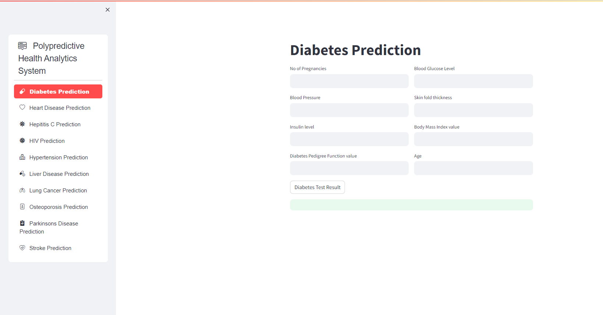

# PolyPredictive Health Analytics System


## Overview
The PolyPredictive Health Analytics System is a comprehensive tool designed to predict the likelihood of various health conditions using machine learning models. This system utilizes pre-trained models stored in `.sav` files and provides an intuitive user interface built with Streamlit. The conditions predicted include:

- Diabetes
- Heart Disease
- Hepatitis C
- HIV
- Hypertension
- Liver Disease
- Lung Cancer
- Osteoporosis
- Parkinson's Disease
- Stroke

## Requirements
- Python 3.7+
- Streamlit
- Pandas
- Scikit-learn
- Pickle

## Installation

1. **Clone the Repository**
   ```bash
   git clone https://github.com/18Aswin/Polypredictive-Health-Analytics-System.git
   ```

2. **Install Dependencies**

3. **Ensure your .sav files are in the models directory**
   Place all your pre-trained model files (.sav) in the `models` directory.

## Directory Structure
```
polypredictive-health-analytics/
│
├── models/
│   ├── diabetes_model.sav
│   ├── heart_disease_model.sav
│   ├── hepatitis_c_model.sav
│   ├── hiv_model.sav
│   ├── hypertension_model.sav
│   ├── liver_disease_model.sav
│   ├── lung_cancer_model.sav
│   ├── osteoporosis_model.sav
│   ├── parkinsons_disease_model.sav
│   └── stroke_model.sav
│
├── Polypredictive_Health_Analytics_System.py
├── run.txt
└── README.md
```

## Usage

1. **Run the Application**
   ```bash
   streamlit run app.py
   ```

2. **Navigate to the Web Interface**
   Open your web browser and go to `http://localhost:8501`

3. **Interacting with the Application**
   - Select the health condition you want to predict from the sidebar.
   - Enter the required input features for the selected condition.
   - Click the "Predict" button to see the prediction results.

```

## Contributing
If you wish to contribute to this project, please follow these steps:

1. Fork the repository
2. Create a new branch (`git checkout -b feature-branch`)
3. Commit your changes (`git commit -m 'Add some feature'`)
4. Push to the branch (`git push origin feature-branch`)
5. Open a Pull Request

## Acknowledgements
Thank you to all the contributors and the open-source community for their invaluable tools and libraries.

## About

Polypredictive Health Analytics System is developed and maintained by Aswin A Nair. Feel free to reach out with any questions or feedback.

---

Feel free to customize the `Polypredictive_Health_Analytics_System.py` and README as per your specific needs and the requirements of your models.
